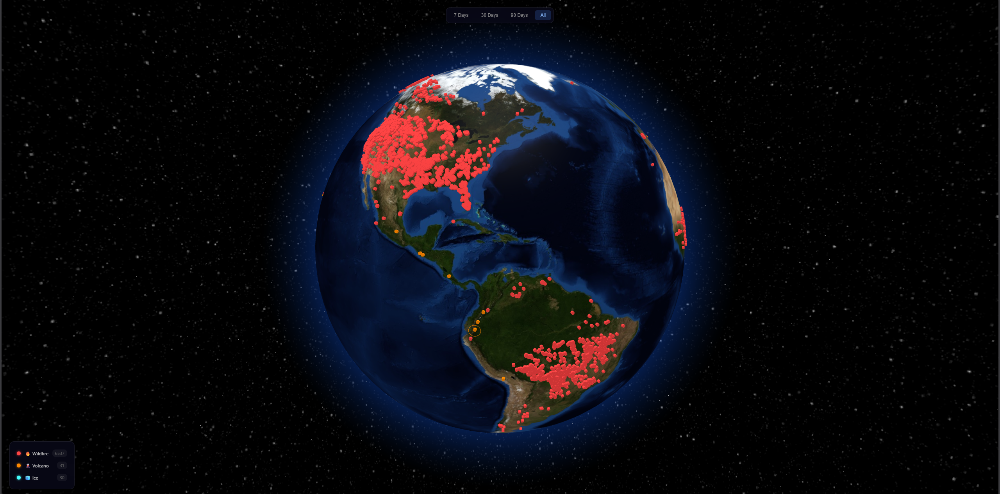
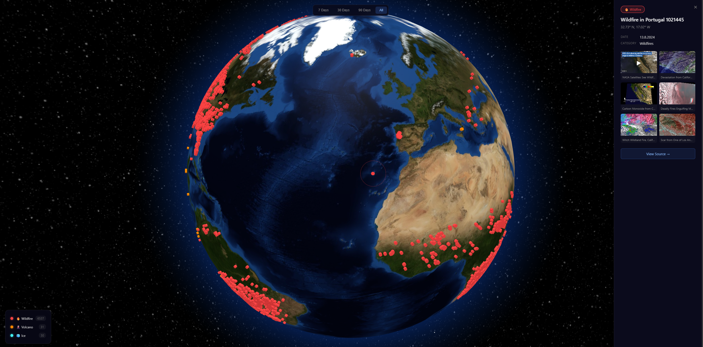

# Earthpulse

An interactive 3D globe visualizing real-time natural events from NASA's EONET (Earth Observatory Natural Event Tracker). Explore wildfires, volcanic eruptions, severe storms, floods, and more — all rendered on a photorealistic rotating Earth.

**[Live Demo](https://earthpulse-six.vercel.app)**

<p align="center">
  
</p>
<p align="center">
  
</p>

> **Disclaimer:** This project was fully vibe-coded with [Claude Code](https://code.claude.com/docs/en/overview).


## Features

- **Real-time data** — Live events from NASA EONET API, auto-refreshes every 5 minutes
- **Interactive 3D globe** — Drag to rotate, scroll to zoom, smooth damping
- **Color-coded markers** — Each event category has a distinct color and emoji
- **Time filtering** — View events from the last 7, 30, 90 days or all time
- **Category filtering** — Click legend items to show/hide categories
- **Event details panel** — Click a marker for full info + images from NASA Image API
- **Connection arcs** — Visual links between nearby events of the same type
- **Responsive** — Works on desktop and mobile (bottom sheet on small screens)

## Tech Stack

| Tool | Purpose |
|------|---------|
| [Globe.gl](https://globe.gl) | 3D globe rendering (Three.js wrapper) |
| [Vite](https://vitejs.dev) | Build tool & dev server |
| [NASA EONET API](https://eonet.gsfc.nasa.gov/docs/v3) | Natural event data |
| [NASA Image API](https://images.nasa.gov/docs/images.nasa.gov_api_docs.pdf) | Event-related imagery |

## Getting Started

```bash
# Clone
git clone https://github.com/kvnlnk/earthpulse.git
cd earthpulse

# Install
npm install

# Dev server
npm run dev

# Production build
npm run build

# Run tests
npm test
```

## Project Structure

```
src/
├── main.js                  # Globe init, event wiring, filters
├── services/
│   ├── EONETService.js      # Fetch & parse EONET events
│   └── NASAImageService.js  # Search NASA Image API
├── panel/
│   ├── EventPanel.js        # Sidebar detail view
│   └── MediaGallery.js      # Image/video lightbox
└── utils/
    └── categories.js        # Color, label & emoji mappings
```

## APIs

Both APIs are public and require **no API key**:

- **EONET v3** — `https://eonet.gsfc.nasa.gov/api/v3/events`
- **NASA Image & Video Library** — `https://images-api.nasa.gov/search`

## Deploy

```bash
npx vercel --prod
```

Or connect the repo to [Vercel](https://vercel.com) / [Netlify](https://netlify.com) for automatic deploys on push.

